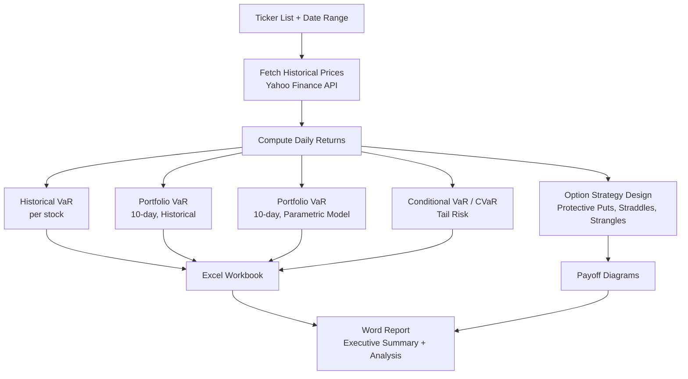

# Portfolio Risk Report Generator

Pulls live market data for any set of stock tickers and automatically generates a full risk analysis — VaR, CVaR, hedging strategies — as a formatted Excel workbook and Word report. What normally takes an analyst hours in spreadsheets, generated in one command.


---

## Why this project

Portfolio risk analysis — Value at Risk, Conditional VaR, hedge design — is standard practice in finance, but building it by hand in Excel for every new portfolio is repetitive and error-prone. This tool automates the entire workflow: give it a list of tickers and a date range, and it fetches real market data, runs the risk calculations, generates hedging strategy visualizations, and produces client-ready deliverables — no manual spreadsheet work required.

## How it works



## What it calculates

| Metric | Method |
|---|---|
| **1-day VaR** | Historical percentile method, per stock |
| **10-day Portfolio VaR (Historical)** | Empirical distribution of portfolio returns |
| **10-day Portfolio VaR (Model)** | Parametric, normal distribution assumption |
| **10-day CVaR (Expected Shortfall)** | Average loss beyond the VaR threshold |

## Outputs

1. **Excel Workbook** — historical prices, returns, VaR (1-day and 10-day), CVaR, and portfolio positions, each in its own sheet
2. **Word Report** — executive summary, portfolio construction, VaR/CVaR results, and hedging recommendations, with charts embedded automatically
3. **Option Strategy Charts** — protective put, straddle, and strangle payoff diagrams

## Quick Start

```bash
git clone https://github.com/<your-username>/portfolio-risk-report-generator.git
cd portfolio-risk-report-generator

pip install -r requirements.txt

python generate_report.py --tickers AAPL MSFT NVDA --start 2024-01-01 --end 2025-01-01 --output ./output
```

This generates an Excel workbook and Word report inside `./output`, along with option strategy charts in `output/figures/`.

### Custom portfolios

```bash
python generate_report.py --tickers AAPL MSFT NVDA GOOGL META --start 2024-01-01 --end 2025-01-01 --output ./custom_analysis
```

## Notes

- The script includes a fixed example position (394 shares of ORCL) as a demonstration of mixed fixed/flexible portfolio allocation — this is easy to remove or change directly in `generate_report.py` for your own use case
- Requires an active internet connection to fetch live price data via `yfinance`
- Option premiums used in the payoff charts are illustrative — extend the code to pull live options data if needed
- Default portfolio size is $1,000,000, configurable in the script

## Tech Stack

`Python` · `yfinance` · `pandas` · `NumPy` · `Matplotlib` · `openpyxl` · `python-docx`

## License

MIT — see [LICENSE](LICENSE).
